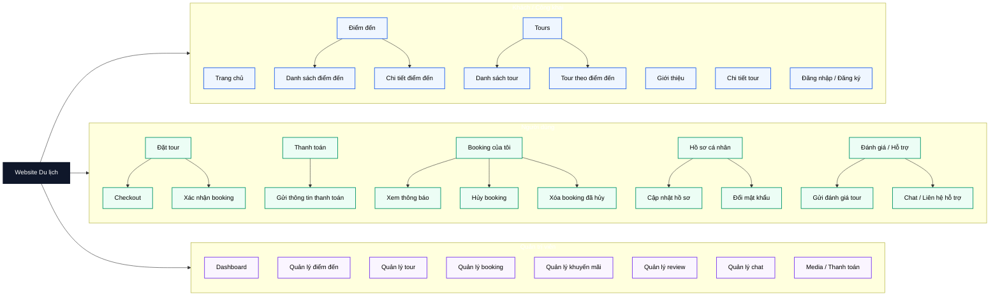

# Sitemap Chức Năng Chính

## 1. Nhóm chức năng chính

### 1.1. Khách / Công khai

- Trang chủ
- Giới thiệu
- Điểm đến
  - Danh sách điểm đến
  - Chi tiết điểm đến
- Tours
  - Danh sách tour
  - Tour theo điểm đến
- Chi tiết tour
- Đăng nhập / Đăng ký

### 1.2. Người dùng

- Đặt tour
  - Checkout
  - Xác nhận booking
- Thanh toán
  - Gửi thông tin thanh toán
- Booking của tôi
  - Xem thông báo
  - Hủy booking
  - Xóa booking đã hủy
- Hồ sơ cá nhân
  - Cập nhật hồ sơ
  - Đổi mật khẩu
- Đánh giá / Hỗ trợ
  - Gửi đánh giá tour
  - Chat / Liên hệ hỗ trợ

### 1.3. Quản trị viên

- Dashboard
- Quản lý điểm đến
- Quản lý tour
- Quản lý booking
- Quản lý khuyến mãi
- Quản lý review
- Quản lý chat
- Media / Thanh toán

## 2. Mermaid Sitemap

## 3. Ghi chú

- Đây là sitemap trình bày chức năng chính, không phải sơ đồ luồng hoạt động.
- Nếu dùng trong slide, nên chụp phần Mermaid ở mục `2`.
- Nếu dùng trong báo cáo, có thể giữ cả mục `1` và mục `2` để vừa có danh sách vừa có sơ đồ.
